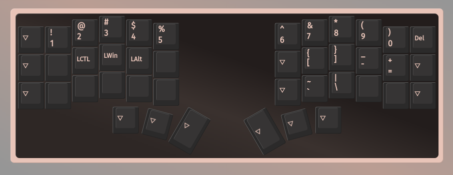

# crkbd-layout
My Corne keyboard layout ⌨️ 

## Hardware

Corne (Helidox) Kit on [mechboards](https://mechboards.co.uk/products/helidox-corne-kit?variant=40391708016845)

Corne Cherry Keyboard Case on [Thingiverse](https://www.thingiverse.com/thing:5736327)

## Firmware

[VIA firmware](https://www.caniusevia.com/docs/download_firmware)

Run [usevia.app](https://github.com/the-via/app) and load `layout.json`. You can also use the [official site](https://usevia.app).

### Layer 0 (Base) 

### Layer 1 (Numbers and symbols)

### Layer 2 (Navigation)

### Layer 3 (RGB Control)

